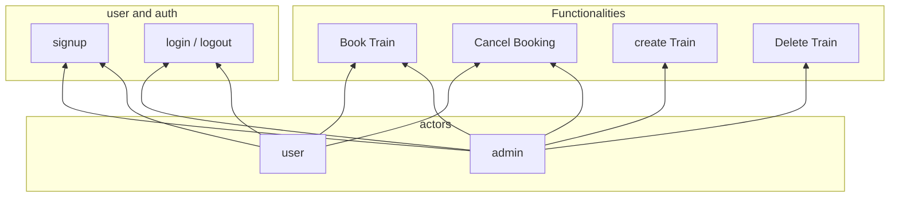

# Railway Mangement System - MERN and Redux

## Description

This Repository Contains the Implementation of Railway Management System Built with MERN. Railway Management System is an application built for users to book trains and administrators to run and manage trains.

## Functionalities

- **End User :** Can **Create/Delete** and **Login/Logout** of account and **Book/Cancel** Trains

- **Admin User :** All the powers of the End user and can also **Create / Remove / Update / Get Details of** Trains

## Tech Stack

- **React** - Frontend

- **Express** - Backend/API

- **MongoDB** - Database

- **Redux** - State Management

- **Node** - Runtime

- **Mongoose** - ORM for Database

- **Other Additional Applications Include :**

  - Postman - for API Testing

  - ROBO3T - Mongo Visualizer

# Thank You
